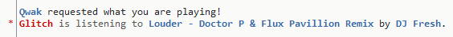

# NowPlaying plugin for HexChat

This HexChat plugin will output what song you're currently listening to on Spotify when someone requests it.

## Usage
Once loaded, a user must type `<username> now playing` and your client will respond with the current track and artist you are listening to.
Example: `glitch now playing`

This plugin uses some modified code from [pytify](https://code.google.com/p/pytify/), a Spotify API for Python.

## Requirements
* Windows
* Spotify
* HexChat (x86 or x64): https://hexchat.github.io/
* Python 2.7 (x86 or x64): https://www.python.org/downloads/
* PyWin32: http://sourceforge.net/projects/pywin32/

## Installation
Download the ZIP and copy `nowplaying.py` to HexChat's addons folder. This is usually located at `C:\Users\<username>\AppData\Roaming\HexChat\addons` or can be found by referencing your `%APPDATA%` variable. After that, type `/py load nowplaying.py` in any HexChat window and the plugin should be loaded.